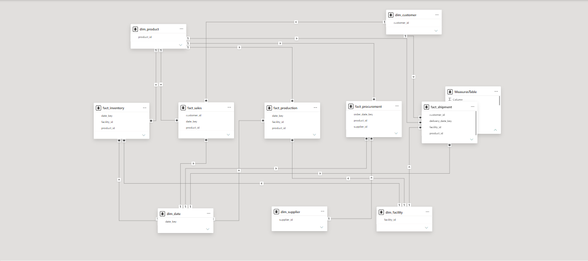
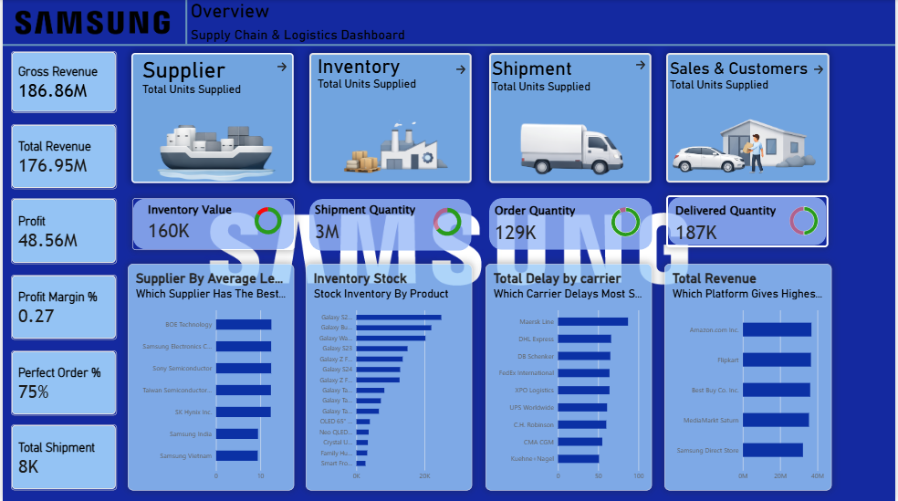

# 📦  Samsung Supply Chain & Logistics Dashboard | Power BI

## 📖 Project Overview

This project is an end-to-end **Supply Chain Analytics Dashboard** developed in **Power BI** to monitor inventory, procurement, production, shipments, customer orders, supplier performance, and warehouse operations.

The dashboard provides actionable insights across the entire supply chain using advanced **Power Query transformations**, **DAX calculations**, and a robust **Star Schema Data Model**.

---

## 🎯 Business Objective

Organizations often face challenges such as:

- Inventory shortages and overstocking
- Supplier delays
- Logistics inefficiencies
- Demand fluctuations
- Warehouse utilization issues
- Poor visibility across supply chain operations

This dashboard helps decision-makers track critical KPIs and optimize supply chain performance through data-driven insights.

---

## 🛠 Tools & Technologies

- Power BI Desktop
- Power Query
- DAX
- Data Modeling
- Supply Chain Analytics
- Business Intelligence

---

## 📊 Dashboard Features

### 1️⃣ Supply Chain Overview

Key KPIs:

- Gross Revenue
- Total Revenue
- Profit
- Profit Margin %
- Perfect Order %
- Total Shipments
- Order Quantity
- Delivered Quantity
- Inventory Value

Insights:

- Revenue Performance
- Monthly Supply Chain Trends
- Operational Efficiency Metrics

---

### 2️⃣ Inventory & Stock Management

- Inventory Value Analysis
- Stock Availability Monitoring
- Inventory Turnover Ratio
- Stock Aging Analysis
- Safety Stock Tracking
- Fast-Moving vs Slow-Moving Products

---

### 3️⃣ Order Fulfillment & Demand Analysis

- Orders by Product Category
- Orders by Region
- Daily / Monthly Order Trends
- Backorders Analysis
- Fulfillment Rate Monitoring
- Lead Time Analysis

---

### 4️⃣ Logistics & Delivery Performance

- On-Time Delivery (OTD)
- Carrier Performance Analysis
- Delivery Delay Trends
- Shipment Performance by Region
- Cost vs Delivery Efficiency
- Delivery Route Insights

---

### 5️⃣ Supplier Performance Dashboard

- Supplier Scorecard
- Vendor Delay Analysis
- Supplier Ranking
- On-Time Supply Rate
- Quality Issue Tracking
- Best & Worst Performing Suppliers

---

### 6️⃣ Warehouse & Regional Analysis

- Warehouse Performance Monitoring
- Capacity Utilization Analysis
- Demand vs Supply Gap
- Regional Performance Comparison
- Geographic Heatmaps

---

## 🏗 Data Model

The project follows a **Star Schema Architecture**.

### Fact Tables

- Fact Inventory
- Fact Sales
- Fact Production
- Fact Procurement
- Fact Shipment

### Dimension Tables

- Dim Product
- Dim Customer
- Dim Supplier
- Dim Facility
- Dim Date

---

## 📈 Key KPIs

- Inventory Turnover Ratio
- Gross Revenue
- Profit Margin %
- Perfect Order Rate
- On-Time Delivery %
- Order Fulfillment Rate
- Supplier Performance Score
- Shipment Efficiency
- Inventory Value
- Stock Availability

---

## 💡 Skills Demonstrated

### Power BI

- Interactive Dashboard Design
- Drill-Through Analysis
- KPI Cards
- Bookmarks
- Slicers & Filters
- Dynamic Reporting

### Power Query

- Data Cleaning
- Data Transformation
- ETL Process Development
- Data Preparation

### DAX

- Time Intelligence Functions
- Inventory Calculations
- Profitability Analysis
- Dynamic Measures
- Supply Chain KPI Development

### Data Modeling

- Star Schema Design
- Relationship Management
- Fact & Dimension Modeling
- Performance Optimization

---

## 📸 Dashboard Preview

### Data Model

### Dashboard Overview

---

## 🎓 Learning Outcomes

✔ Supply Chain KPI Development

✔ Inventory Analytics

✔ Logistics Performance Tracking

✔ Supplier Evaluation Framework

✔ Warehouse Analytics

✔ Advanced DAX Calculations

✔ Power Query ETL Workflows

✔ Business Intelligence Reporting

---

## 👨‍💼 Author

**Ninaad Rajput**

MBA (Operations & Supply Chain Management)

Former Supply Chain Intern – Flipkart

🔗 LinkedIn: *linkedin.com/in/ninaad-rajput-428846417*

---

### ⭐ If you found this project useful, consider giving it a star!
